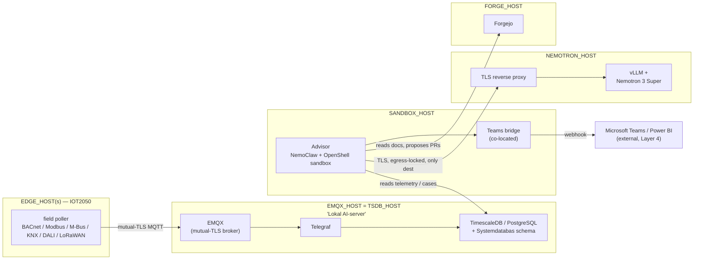

# openAut architecture & where these skills fit

> ⚠️ **Learning project — not for production.** This is a development/learning exploration of AI in
> building management, not a product. Do not use against live or safety-critical systems. See the
> [README](../README.md#️-learning-project--not-for-production) for the full disclaimer.

This pack provisions the **agent workbench** and core contracts of an
[openAut](https://openaut.io) deployment. openAut is a four-layer, on-premise building-management AI:
field data flows up through edge nodes to an on-site AI tier, and role-specific agents push insight
back out to people. Operational data, manuals, code, the AI index, and inference stay on-prem; Teams
is the human notification and decision channel.

The current public architecture splits the operating agents into stricter trust domains:

- **openAut Advisor** — read-only and Teams-facing; explains alarms, anomalies, and recommendations.
- **openAut Engineer** — SSH/deploy capable from a controlled management plane; not exposed to Teams.
- **openAut Security** — separate read-only/watch-only instance; alerts an isolated security channel.

The older Driftstekniker/Energisamordnare/Förvaltare personas still describe useful *jobs to be
done*. Advisor/Engineer/Security describe the trust boundaries those jobs must run inside.

## The four layers

```
┌─────────────────────────────────────────────────────────────────────────────┐
│ LAYER 4 — INTERFACE                                                           │
│   Microsoft Teams  ·  web dashboard  ·  Power BI  ·  REST API                 │
│        ▲                                                                      │
│        │  Teams webhook bridge  (bridges/teams-webhook)         ◀── DEFAULT   │
│        │                                                                      │
│ ┌──────┴───────────────────────────────────────────────────────────────────┐│
│ │ LAYER 3 — AI (on-prem)                                                     ││
│ │                                                                            ││
│ │   ┌──────────────── NemoClaw sandbox (DGX Spark / RTX) ─────────────────┐  ││
│ │   │  Landlock + seccomp + netns                                         │  ││
│ │   │                                                                     │  ││
│ │   │   Driftstekniker   Energisamordnare   Förvaltare   ◀── 3 role agents│  ││
│ │   │   (alarm RCA)      (weekly energy)    (status/forecast)             │  ││
│ │   │        │                  │                 │                       │  ││
│ │   │        └──── tool calls ──┴──── read/write ─┘                       │  ││
│ │   └─────────┬───────────────────────────────────────────┬─────────────┘  ││
│ │             │ inference (TLS, egress-locked)             │ data            ││
│ │             ▼                                            ▼                 ││
│ │   ┌──────────────────────┐                  ┌──────────────────────────┐  ││
│ │   │ Nemotron 3 Super box │                  │ EMQX (MQTT/TLS)          │  ││
│ │   │ vLLM + TLS proxy     │  ◀── DEFAULT     │ TimescaleDB · PostgreSQL │  ││
│ │   │ (separate machine)   │                  └────────────▲─────────────┘  ││
│ │   └──────────────────────┘                               │                ││
│ └──────────────────────────────────────────────────────────┼───────────────┘│
│                                                             │ encrypted MQTT │
│ ┌───────────────────────────────────────────────────────────┴──────────────┐│
│ │ LAYER 2 — EDGE                                                            ││
│ │   Siemens SIMATIC IOT2050 nodes · protocol drivers · local buffer        ││
│ └───────────────────────────────────────────────────────────┬──────────────┘│
│                                                              │               │
│ ┌────────────────────────────────────────────────────────────┴─────────────┐│
│ │ LAYER 1 — FIELD                                                           ││
│ │   sensors · meters · PLCs   ·   BACnet / Modbus / M-Bus / KNX / DALI /    ││
│ │                                  LoRaWAN   ·   Python edge regulation     ││
│ └──────────────────────────────────────────────────────────────────────────┘│
└──────────────────────────────────────────────────────────────────────────────┘

◀── DEFAULT  = the two choices baked into this skill pack
```

## Deployment topology — which servers, and what goes on each

The layer diagram above shows trust domains, not a rack list. This section maps it onto physical/
virtual hosts. Two footprints exist in the docs today and they are **not** the same: what this pack
currently provisions (matches `config.env.example`, Advisor only) and the fuller target ADR 0001 /
ADR 0003 describe once Engineer and Security ship. The gap is called out rather than papered over.

### Current pack scope (Advisor only)

| Host (env var in `config.env.example`) | Example | Installs | Defined in |
|---|---|---|---|
| `SANDBOX_HOST` | `dgx-spark.local` | NemoClaw (Advisor) + OpenShell sandbox; Teams webhook bridge co-located | `nemoclaw-provision`, `bridges/teams-webhook` |
| `NEMOTRON_HOST` | `192.168.1.43` (GX10 — Bertil/test box) | vLLM + Nemotron 3 Super + TLS reverse proxy | `nemoclaw-sandbox-policy` |
| `EMQX_HOST` = `TSDB_HOST` (same host in the reference config) | `192.168.1.10` — the "AI-tier"/"Lokal AI-server" host | EMQX (mutual-TLS broker) + Telegraf ingest + TimescaleDB/PostgreSQL + Systemdatabas schema | `mqtt-tls-broker`, `timeseries-stack`, `system-database` |
| `FORGE_HOST` | `192.168.1.20` | Forgejo | `forge-stack`, `forge-governance` |
| `EDGE_HOST` (one per field segment) | `192.168.1.50` | IOT2050 field poller | `edge-iot2050` |



### Full target posture (ADR 0001 §5 / ADR 0003 — not yet in `config.env.example`)

Once Engineer and Security ship, two more hosts join, plus two supporting components, and production
swaps the model box:

| Host / component | Installs | Why it's a separate host | Defined in |
|---|---|---|---|
| Engineer host (management plane) | opencode + an Engineer-specific sandbox policy (same Landlock/seccomp/netns primitives as Advisor's OpenShell, different policy) | Different trust domain from Advisor, deliberately different stack and host (ADR 0001 §5) | ADR 0001 §4, ADR 0003 |
| Security host (isolated) | Security instance — read-only SSH, listen-only Teams, passive MQTT/log watch | Must audit Engineer without being silenceable by it | ADR 0001 §5, ADR 0003 §4 |
| Credential proxy | mints short-lived, case-scoped credentials | No raw SSH/inference secrets ever sit in an agent's context | ADR 0003 §3 |
| Append-only audit sink | external collector | Engineer can write to it but can never mute or read it back | ADR 0003 §4 |

Production also swaps `NEMOTRON_HOST` from the GX10 (Nemotron 3 Super, Bertil/test only) for a dedicated
**Nemotron 3 Ultra** box, and the whole perimeter above runs **air-gapped** — Main stays a cloud
development environment, and only a signed, reviewed release crosses the air gap in (ADR 0001).

> **Hard rule, not a lab shortcut:** Advisor and Engineer must never share a host, sandbox instance, or
> policy profile (ADR 0003, "alternatives considered" — rejected precisely because it collapses this
> separation). A lab/rehearsal setup (see [`docs/LAB.md`](LAB.md)) can colocate the data backbone — EMQX,
> TimescaleDB, and the Systemdatabas schema on one box, as `config.env.example` already does — but
> Advisor, Engineer, and Security stay on separate hosts even at lab scale; that separation is the
> control, not an optimization to relax under resource pressure.

## What this pack provisions

| Skill | Layer | Responsibility |
|---|---|---|
| [`nemoclaw-provision`](../skills/nemoclaw-provision/SKILL.md) | 3 | Install NemoClaw on the sandbox host; onboard a sandbox pointed at the **remote Nemotron 3 Super** endpoint; attach the **Teams** bridge; verify. |
| [`nemoclaw-sandbox-policy`](../skills/nemoclaw-sandbox-policy/SKILL.md) | 3 | Lock the sandbox: deny-by-default egress to **only** the Nemotron host + local Forge + Teams bridge; TLS in front of vLLM; IEC 62443 / NIS2 / CRA review. |
| [`advisor-engineer-workflow`](../skills/advisor-engineer-workflow/SKILL.md) | 3→4 | Define Advisor (read-only, Teams), Engineer (SSH/deploy, no Teams), and the approved-case handoff through the Systemdatabas. |
| [`nemoclaw-agent-workflow`](../skills/nemoclaw-agent-workflow/SKILL.md) | 3→4 | Define the older three role personas as jobs-to-be-done; useful for mapping operational tasks into Advisor/Engineer boundaries. |
| [`bridges/teams-webhook`](../bridges/teams-webhook/README.md) | 4 | Map Teams ↔ the OpenClaw gateway (NemoClaw has no native Teams channel). |
| [`mqtt-tls-broker`](../skills/mqtt-tls-broker/SKILL.md) | 3 | EMQX mutual-TLS broker, per-node cert PKI, CN-bound ACL topic schema — the encrypted ingest backbone. |
| [`timeseries-stack`](../skills/timeseries-stack/SKILL.md) | 3 | TimescaleDB + PostgreSQL, MQTT→DB ingest, retention/aggregates, least-privilege roles. |
| [`system-database`](../skills/system-database/SKILL.md) | 3 | Define the Systemdatabas contract: equipment, points, documents, cases, approvals, generated artifacts, and audit events. |
| [`forge-stack`](../skills/forge-stack/SKILL.md) | 3 | Provision local Forgejo as the versioned system of record for code, manuals, runbooks, generated docs, migrations, and artifacts. |
| [`documentation-store`](../skills/documentation-store/SKILL.md) | 3 | Define Forge-backed documentation retrieval, `forge://` URIs, independent `documents.sha256`, and quarantine-to-verified trust flow. |
| [`forge-governance`](../skills/forge-governance/SKILL.md) | 3 | Define PR review, branch protection, CI gates, CODEOWNERS, signing, and scoped agent permissions. |
| [`edge-iot2050`](../skills/edge-iot2050/SKILL.md) | 2 | Siemens IOT2050 edge node: field poller → EMQX over mutual TLS, store-and-forward buffering. |
| [`engineer-integration`](../skills/engineer-integration/SKILL.md) | 2→3 | Define Engineer's approved manual-to-integration workflow: parse manufacturer docs, deploy to edge over SSH, verify data, and write generated documentation. |
| [`security-instance`](../skills/security-instance/SKILL.md) | 3→4 | Define the separate Security instance: read-only SSH, listen-only Teams observation, passive MQTT/log monitoring, isolated alerts. |

## The two defaults, and why

- **Microsoft Teams as the channel.** openAut targets the Microsoft stack (Teams + Power BI). NemoClaw
  ships Telegram/Discord/Slack but not Teams, so the pack adds a webhook bridge and points every
  persona at it. Swap it by editing `TEAMS_*` in `config.env`, or graduate to Azure Bot Service later
  without changing the agents.
- **Local Forgejo as the project forge.** Code, manuals, runbooks, generated docs, migrations, and
  deployable artifacts live in a local forge in the AI/management zone, with scoped agent access and
  CI/review gates before anything becomes trusted or deployable.
- **Remote Nemotron 3 Super, egress-locked + TLS.** The 120B MoE model lives on a dedicated GPU box
  (e.g. ASUS Ascent GX10 running vLLM). The sandbox reaches it over TLS and is allowed to reach
  *nothing else* — turning "an agent with shell access" into "an agent that can only talk to its model
  and its channel". This is the control that satisfies the openAut NIS2 / IEC 62443 posture.

## Trust boundaries

1. **Field/edge → AI** — edge nodes publish over **encrypted MQTT (TLS)** to EMQX. Untrusted sensor
   data; validated before it reaches an agent.
2. **Agent → model** — sandbox → Nemotron over **TLS, single allow-listed destination**. No fallback
   to public LLM APIs (AI Act provider control).
3. **Advisor → people** — Advisor speaks through the Teams bridge, which **HMAC-verifies** inbound
   Teams calls. Inbound Teams text is treated as untrusted (prompt-injection surface); the sandbox
   policy and read-only tool grant are the backstop.
4. **Advisor → Engineer** — no direct chat-to-SSH path. Advisor creates a case/approval request in
   the Systemdatabas; Engineer acts only on approved cases from the management plane.
5. **Agents → Forge** — Advisor reads verified docs, Engineer writes branches/PRs, and Security
   watches org-wide. No agent can self-merge protected branches or change branch protection.
6. **Security → deployment** — Security observes via read-only SSH, listen-only Teams, and passive
   MQTT/log access. It alerts an isolated channel but has no operational write path.
7. **Sandbox kernel boundary** — Landlock (filesystem), seccomp (syscalls), netns (network) confine
   the agent regardless of what a prompt convinces it to attempt.

## Runtime capabilities the agents carry

The pack also includes the runtime skills each persona is granted (least-privilege) in
[`nemoclaw-agent-workflow`](../skills/nemoclaw-agent-workflow/SKILL.md):

- **Field protocols (Layer 1):** [`bacnet`](../skills/bacnet/SKILL.md),
  [`modbus`](../skills/modbus/SKILL.md), [`mbus`](../skills/mbus/SKILL.md),
  [`knx`](../skills/knx/SKILL.md), [`dali`](../skills/dali/SKILL.md),
  [`lorawan`](../skills/lorawan/SKILL.md) — read field data; the edge poller and agents use these.
- **Analytics (Layer 3):** [`fdd`](../skills/fdd/SKILL.md),
  [`energy-optimization`](../skills/energy-optimization/SKILL.md),
  [`anomaly-correlation`](../skills/anomaly-correlation/SKILL.md) — turn telemetry into diagnosis,
  savings, and root-cause alerts.
- **Compliance references:** [`nis2`](../skills/nis2/SKILL.md), [`cra`](../skills/cra/SKILL.md),
  [`ai-act`](../skills/ai-act/SKILL.md), [`iso27001`](../skills/iso27001/SKILL.md),
  [`iec62443`](../skills/iec62443/SKILL.md) — the legal/standards backdrop the design is built to.

## Genuinely out of scope

openAut's own Layer-4 application code — the web dashboard, Power BI models, REST API — is the product
itself. These skills *operate and secure* a deployment; they don't replace that application.
