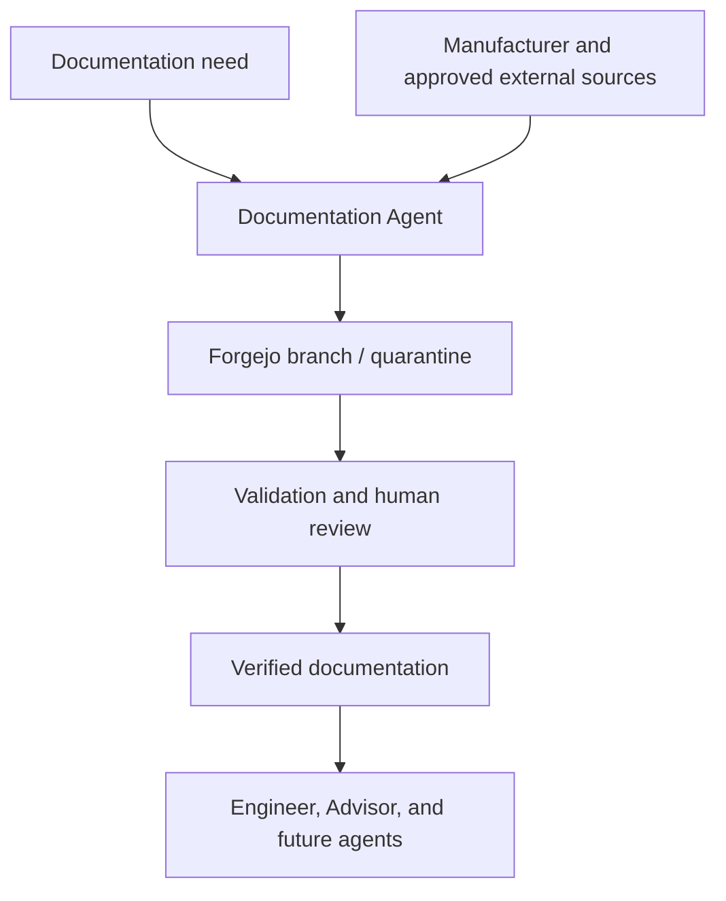

# Documentation Agent — target architecture

## Purpose

openAut shall introduce a separate **Documentation Agent** that supplies the other agents with
traceable, structured, and reviewable technical product documentation.

The Documentation Agent becomes openAut's controlled entry point for external technical knowledge.
It turns a documentation need into reusable content in the local Forgejo knowledge store. Engineer,
Advisor, and future agents consume that local knowledge according to its recorded trust level.

This design builds on the existing
[`manual-ingest`](../../skills/manual-ingest/SKILL.md) and
[`documentation-store`](../../skills/documentation-store/SKILL.md) capabilities.

## Target flow



A request may name an exact product and document, or describe an information need such as a protocol
register map, commissioning procedure, PICS, EDE file, certificate, or firmware note.

The Documentation Agent shall:

1. interpret the request and identify the product, version, protocol, and required document types;
2. search approved external sources, prioritising the manufacturer and other authoritative publishers;
3. distinguish exact product matches from related families, variants, and obsolete revisions;
4. select the documents relevant to the requested engineering task;
5. preserve source provenance, retrieval time, document identity, revision, and source hash;
6. convert relevant content into a structured, AI-readable format while retaining warnings, tables,
   units, register addresses, diagrams or captions, page references, and stated uncertainty;
7. invoke the existing `manual-ingest` workflow to create stable product and document identities,
   validate the archive, rebuild the catalogue, and place new material in quarantine;
8. create a Forgejo branch or pull request for validation and human review; and
9. make the approved Forge reference available through the documentation-store and Systemdatabasen.

## Responsibilities

### Documentation Agent

The Documentation Agent owns the path from external discovery to staged local documentation.

It is responsible for:

- product and document identification;
- source discovery and source-quality assessment;
- download, parsing, OCR, and format conversion in an isolated workspace;
- relevance filtering and structured extraction;
- metadata, provenance, checksums, and catalogue generation through `manual-ingest`;
- branches and pull requests in `openaut/manuals`;
- reporting ambiguity, missing revisions, conflicting values, and incomplete source material.

It may propose documentation for verification but does not grant `verified` status to its own
output.

### Engineer

Engineer states the documentation need and consumes approved documentation from the local store.
Its engineering workflow can then focus on integration planning, configuration, programming,
testing, deployment, and generated site documentation.

When the required documentation is missing, Engineer creates a documentation request instead of
searching the public Internet or processing untrusted external documents in the Engineer trust
domain.

### Human reviewer

The reviewer confirms product identity, revision, source fidelity, completeness, and
safety-relevant values before changing the trust level to `verified`. The review also resolves
conflicts that cannot be settled deterministically.

### Security

Security observes documentation ingestion and Forge changes for suspicious content, secrets,
unexpected binaries, unsafe embedded instructions, provenance gaps, and abnormal agent behaviour.
It remains an independent, non-approving trust domain.

## Trust boundary and permissions

External documents are data, not agent instructions. Search results, web pages, PDFs, office
documents, archives, and embedded links are treated as untrusted input.

| Capability | Documentation Agent | Engineer |
|---|---:|---:|
| Search approved Internet sources | Yes | No |
| Download external technical documents | Yes | No |
| Parse, OCR, and convert external documents | Yes, isolated | No |
| Read and write working branches in `openaut/manuals` | Yes | Read verified content; write generated engineering artifacts |
| Assign `verified` trust level | No | No |
| Access OT networks or field devices | No | Case-scoped and approved |
| SSH or deploy to edge nodes | No | Case-scoped and approved |
| Modify its own policy or credentials | No | No |

The Documentation Agent has no OT route, no edge-node credentials, no deployment capability, and no
access to Engineer's work directory. Its Internet allow-list and Forge credentials are separate
from the identities used by Advisor, Engineer, and Security.

Downloaded source files and conversion tools run in a disposable workspace with bounded CPU, memory,
time, and output size. Conversion does not receive Forge administration credentials, OT credentials,
deployment paths, or access to other trust domains.

## Documentation request contract

A documentation request should contain the known identity and the engineering purpose without
requiring the requester to know the exact document title.

```yaml
request_id: docreq-...
requested_by: engineer
manufacturer: Siemens
product_family: Desigo PXC4
model: PXC4.E16
hardware_revision: unknown
firmware: unknown
protocols:
  - bacnet
needed_information:
  - object model
  - supported BACnet services
  - commissioning procedure
preferred_languages:
  - en
  - de
case_id: optional-system-case-id
```

The result should identify what was found, why it matches, its trust state, and any unresolved gaps.

```yaml
request_id: docreq-...
status: staged
product_id: ...
documents:
  - document_type: engineering-manual
    document_number: ...
    revision: ...
    source_url: ...
    source_domain: ...
    retrieved_at: ...
    sha256: ...
    trust_level: quarantine
    forge_uri: forge://openaut/manuals/...?commit=...
unresolved:
  - firmware compatibility requires reviewer confirmation
```

The exact storage schema remains governed by `manual-ingest`,
`documentation-store`, and Systemdatabasen rather than being duplicated here.

## Relationship to existing capabilities

### `manual-ingest`

`manual-ingest` remains the deterministic archive and catalogue capability. The Documentation
Agent supplies its source document, converted Markdown, and confirmed metadata. The skill continues
to provide stable identities, SHA-256 validation, atomic archive staging, quarantine status,
validation, and catalogue generation.

Parsing and OCR currently described as occurring in a disposable Engineer workspace should move to
the Documentation Agent workspace when this target architecture is implemented.

### `documentation-store`

`documentation-store` remains the authority for Forge URIs, content integrity, trust levels,
repository conventions, and retrieval. The Documentation Agent becomes an authorised producer of
quarantined content; Engineer and Advisor remain consumers of verified content.

### `engineer-integration`

`engineer-integration` should resolve required product information from the local documentation
store. Missing information produces a documentation request. Once verified material is available,
the existing integration workflow continues from manual interpretation through planning, operator
confirmation, deployment, verification, and generated documentation.

## Knowledge reuse

A completed documentation request is not temporary context for one engineering session. Its output
becomes shared, versioned project knowledge.

Stable product identity allows several installed equipment records to refer to the same verified
documentation. New revisions can be added without overwriting history, and superseded documents
remain available for audit and older installed equipment.

The same supply path can later support manuals, datasheets, protocol specifications, register
lists, PICS, EDE files, declarations, certificates, firmware release notes, installation
instructions, and other vendor technical material.

## Implementation path

1. Define the Documentation Agent identity, sandbox, network allow-list, Forge permissions, and
   audit events.
2. Define the documentation request and result records in Systemdatabasen.
3. Implement source discovery with an authoritative-source policy and explicit provenance capture.
4. Move PDF parsing, OCR, and conversion into the isolated Documentation Agent workspace.
5. Connect conversion output to the existing `manual-ingest` validation and catalogue workflow.
6. Add Forgejo branch/PR automation and human verification gates.
7. Update `documentation-store`, `engineer-integration`, and the trust-domain documentation to
   use the request contract.
8. Verify the security invariants and run an end-to-end test with several product families and
   document types.

Until the automated supply path is implemented, documentation may continue to be supplied manually
to the existing ingest and verification workflow. This preserves the same target data model and
lets current and future proof-of-concept work contribute to the shared documentation library.

## Acceptance criteria

The target capability is complete when:

- Engineer can request documentation without using public Internet access;
- the Documentation Agent finds and distinguishes exact product and revision matches;
- every staged document has source provenance, identity metadata, a source hash, and a trust level;
- conversion runs in an isolated, disposable workspace;
- new content enters Forgejo through a branch or pull request and defaults to quarantine;
- only an independent review can promote content to verified;
- verified content is resolvable by stable Forge URI and linked from Systemdatabasen;
- Engineer can consume the verified content without access to the original Internet source; and
- audit evidence covers the request, discovery, ingestion, review, and resulting Forge revision.

> **Target architecture:** This document defines the intended documentation-supply capability.
> Detailed runtime implementation and live behaviour remain to be validated in the openAut lab.
